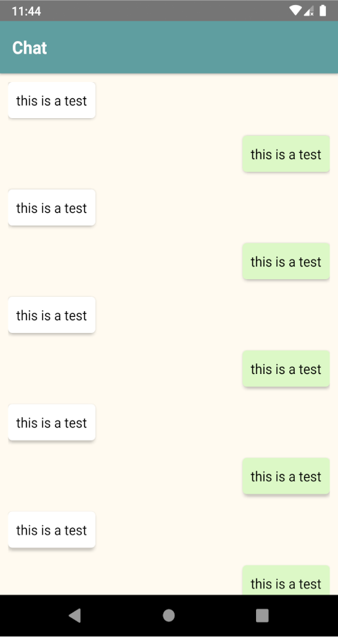

# StylingFlatlistChatBubbles
Una app en React Native para mostrar como aplicar estilos a un componente FlatList

### Para usar:

1. Clonar el repo o descargar como zip.
2. Navegar hasta la carpeta del proyecto desde la terminal e instalar las dependencias: `npm install` o `yarn install`
3. Ejecutar el servidor: `react-native start`
4. Ejecutar: `react-native run-android` o  `react-native run-ios` según corresponda.

Nota: obviar el paso 3 si al ejecutar el paso 4 el servidor arranca automáticamente.